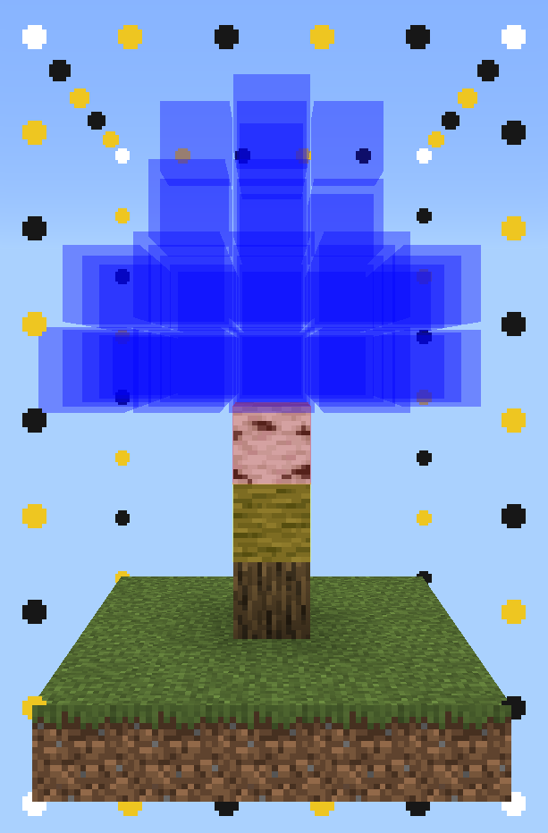

    
    
<b>Construct</b>

[-brightgreen)](https://feedback.minecraft.net/hc/en-us/sections/360001186971-Release-Changelogs)

---

Give yourself the tools to ease the survival building process with Construct, an addon designed to help you transfer your builds from creative to survival. Construct offers these convenient features and several more:

- **Easy Place**: Always places blocks correctly.
- **Block Validation**: Highlights incorrect blocks.
- **Material Grabbing**: Pulls required materials from chests in just one click.
- **Layered Building**: Build structures in layers.
- **Structure Management**: Create and edit many structures at once.
- **Structure Importing**: Import structures from other worlds quickly and easily.

    

> [!IMPORTANT]
> This is a standalone addon, but it is also a **Canopy Extension**, which means **Canopy** can be installed in your world for the best experience!
> [Download **Canopy** here!](https://github.com/ForestOfLight/Canopy)

## Usage

Construct's latest release can be downloaded from its [Releases Page](https://github.com/ForestOfLight/Construct/releases) right here on GitHub. Install it just like any other addon, though make sure the Beta APIs experiment is enabled!

### Construct Menu

Use `/construct:item` to get the Construct item, which opens the Construct menu. This item is also available in the Creative inventory under the "Items" tab. Using the Construct item will open a menu where you can manage your structures instances. You can create new instances of structures, edit existing ones, and delete them when you no longer need them. There are plenty options available to customize your building style!

*Pro tip: You can name the Construct item after a structure instance to automagically select it when you open the menu!*

Don't forget to check out the **Builder Settings** tab, where you can improve your building experience with Easy Place and Material Grabbing options!

### Adding New Structures

Construct uses Minecraft's vanilla structure system so that you can easily create and build new structures.

- The simplest way to add a new structure to the structure list is to save it using a structure block.
- Importing structures from other worlds is as simple as dropping the `.mcstructure` file in Construct's `Construct [BP]/structures` folder. Then, to select your structure in the Construct menu, choose "Other" when presented with the structures and enter the filename (without including ".mcstructure"). You only need to do this once with new structures, since Construct will save them for future use!

### Commands

**Usage: `/construct:item`**  
Gives you the Construct item. Use it to open the Construct menu.

**Usage: `./construct`**  
Shows the Construct menu. Only available while **Canopy** is installed.

## Join the Community

Need help, want to discuss technical Minecraft, or follow future updates? [**Join our Discord!**](https://discord.gg/9KGche8fxm)

## Roadmap

- [x] Form to manage structures
- [x] Structure naming & movement
- [x] Easyplace
- [x] Correct block placement checking
- [x] Automatic material gathering from inventories
- [x] Material list
- [ ] Block texture display

## Issues & Suggestions

If you have any issues or suggestions, please don't hesitate to open an issue on this repo. Additionally, if you're interested in contributing to the project, feel free to open a pull request!
